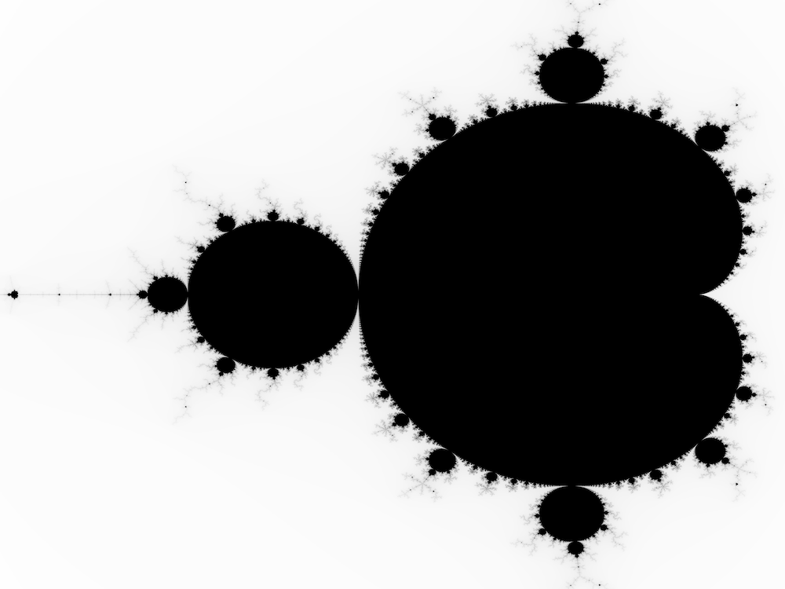

# Mandelbrot

Exploring various programming languages by building and plotting the Mandelbrot set.



## Zig

Step-by-Step Guide: [Exploring Zig Programming Language with The Mandelbrot Set](https://www.rdiachenko.com/posts/zig/exploring-ziglang-with-mandelbrot-set/).

Build, test and run:

```shell
cd zig-mandelbrot

zig build -Doptimize=ReleaseFast \
    test \
    run --summary all \
    -- mandelbrot.png 4000x3000 -1.8,1 0.5,-1
```
